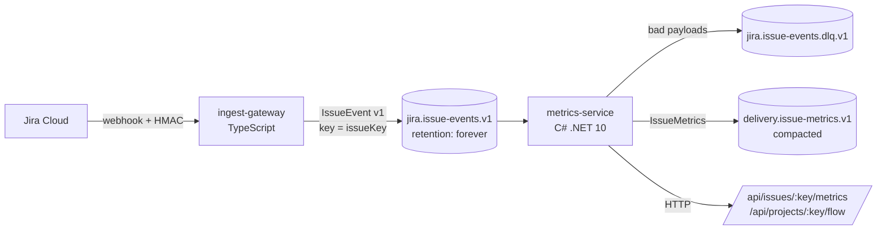

# Jira flow add-on: architecture

## Data flow

1. Jira sends `jira:issue_created | issue_updated | issue_deleted` webhooks, signed with `X-Hub-Signature: sha256=…`.
2. The gateway verifies the HMAC over the raw bytes (constant-time), keeps only status-relevant changes, and maps Jira's three fixed status categories (`new`, `indeterminate`, `done`) to `todo`, `in_progress`, `done`. Mapping on category instead of status name means any team's custom workflow works without config.
3. It publishes with the issue key as message key, so every event for one issue is on one partition, in order. It answers 202 only after Kafka acks; otherwise Jira gets a 5xx and retries.
4. The C# consumer applies each event to that issue's timeline and recomputes metrics from the sorted history, then publishes the result.

## Delivery guarantees (why the numbers stay right)

| Failure | Handling |
|---|---|
| Jira retries a webhook | Event id is deterministic (`jira:{issueId}:{timestamp}:{kind}`), so the consumer dedupes it |
| Broker retry on produce | Idempotent producers, `acks=all` |
| Consumer crash mid-batch | Offsets are stored only after an event is handled (at-least-once) + dedupe = effectively once |
| Late or out-of-order event | Metrics are recomputed from the full time-sorted history, never incrementally |
| Unparseable or future-schema event | Sent to the DLQ with reason headers; the partition keeps moving |
| Service restart / rebalance | In-memory state is rebuilt by replaying owned partitions from offset 0 (topic retention is infinite) |

## Metric definitions

- **Lead time**: created → final entry into a done-category status.
- **Cycle time**: first entry into an in-progress-category status → final done. Issues that skip in-progress have no cycle time instead of a fake zero.
- **Reopen count**: transitions out of done.
- **Project flow**: P50 and P85 of cycle and lead time over completed, non-deleted issues. Percentiles, not means, because these distributions are right-skewed; P85 is the usual service-level forecast in flow-based planning. Interpolation is linear between closest ranks (R-7 / Excel `PERCENTILE.INC`).

## Known limits (deliberate, tracked in the backlog)

- State is in memory, so `metrics-service` runs as one replica and replays on start. Replay time grows with history; a durable store removes both limits.
- Replay republishes metrics; harmless because the metrics topic is compacted and values are deterministic, but consumers of it should treat records as upserts.
- No historical backfill yet: only issues that change after the webhook is registered are seen. A Jira REST backfill job is in the backlog.
- Calendar time, not business days. Whether to exclude weekends is a product call.
