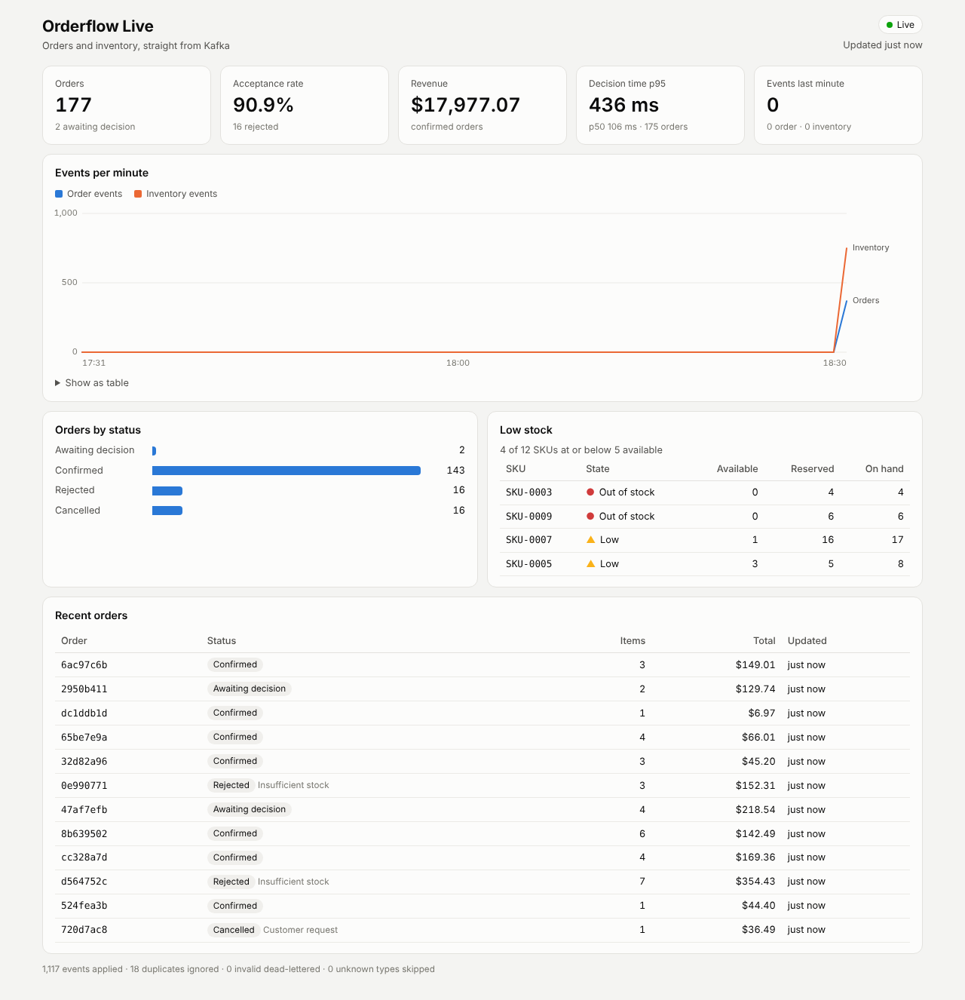

# Orderflow Live (dashboard)

A live dashboard for the order and inventory platform. A Node service consumes the services'
Kafka events, folds them into an in-memory read model, and pushes snapshots to a React page over
Server-Sent Events. Tested with Jest, including against a real Kafka broker.



| Package | What |
|---|---|
| `packages/contracts` | Zod schemas for the events in [services/docs/events.md](../services/docs/events.md), plus the dashboard's own DTOs |
| `packages/api` | Kafka consumer, read model, HTTP + SSE API (Fastify), event simulator |
| `packages/web` | React dashboard (Vite), served by the API in production |

## Run it

With the whole platform (Kafka, Postgres, both C# services, dashboard):

```sh
cd dashboard
docker compose up --build                       # http://localhost:8080
docker compose --profile simulator up --build   # plus synthetic traffic
```

Locally, against any broker (`localhost:9094` is the services' compose broker):

```sh
npm ci
KAFKA_BROKERS=localhost:9094 npm run dev:api    # API on :8080
npm run dev:web                                 # UI on :5173, proxies /api
KAFKA_BROKERS=localhost:9094 npm run simulate -- --rate 5   # optional fake traffic
```

## Test

```sh
npm run typecheck
npm test                                              # contracts, api, web (jsdom)
KAFKA_BROKERS=localhost:9092 npm run test:integration # needs a broker
```

The integration test creates throwaway topics, writes history (including a redelivered event, a
malformed message and an unknown event type), starts the real consumer, and checks that it
replays, becomes ready, follows live traffic, ends with the same stock as the producer, and
dead-letters only the malformed message.

## API

| Route | |
|---|---|
| `GET /api/snapshot` | Everything the dashboard shows |
| `GET /api/stream` | SSE: a `snapshot` event on connect and whenever the state changes (coalesced, at most every `STREAM_INTERVAL_MS`) |
| `GET /api/orders?status=&limit=` | Orders, newest first |
| `GET /api/orders/:orderId` | One order |
| `GET /api/inventory?lowStock=true` | Stock per SKU |
| `GET /healthz` | Liveness: fails if the consumer has died for good |
| `GET /readyz` | Readiness: 503 until the consumer has replayed the topics to their end offsets at startup |
| `GET /metrics` | Prometheus |

Configuration is by environment variable, validated at startup (`packages/api/src/config.ts`):
`KAFKA_BROKERS`, `KAFKA_SSL`, `KAFKA_SASL_MECHANISM`/`_USERNAME`/`_PASSWORD`, `ORDERS_TOPIC`,
`INVENTORY_TOPIC`, `DEAD_LETTER_ENABLED`, `LOW_STOCK_THRESHOLD`, `CURRENCY`, `PORT`, `STATIC_DIR`.

## Design decisions

- **Replay into memory, gate readiness on it.** The read model is rebuilt from the topics on
  start. Each process uses its own consumer group so every replica reads every partition, and
  `/readyz` stays 503 until the end offsets captured at startup are reached, so Kubernetes never
  routes traffic to a half-built view. Trade-off: start-up time grows with topic retention; a
  persistent store (Postgres or Redis) or a compacted snapshot topic is the next step at scale.
- **Idempotent and order-safe.** Events are deduplicated on `eventId` (bounded window), orders
  only move along the saga (placed to confirmed, rejected or cancelled; confirmed to cancelled),
  and stock keeps the highest per-SKU `version`, so redeliveries and replays can't roll state back.
- **Poison messages don't block.** Invalid messages are counted, sent to `<topic>.dlt` with the
  platform's `dlt-*` headers, and skipped. Unknown event types and newer schema versions are
  skipped without dead-lettering, as the contract requires.
- **Money as integer cents.** The services publish decimals; amounts are converted once at the
  boundary so sums don't drift.
- **Bounded push.** SSE snapshots are coalesced per tick and serialized once for all clients,
  so a burst of events costs a fixed number of messages.
- **Charts.** Per-minute throughput is one axis (both series are event counts), with a legend,
  direct labels, a keyboard-accessible tooltip and a table view; the palette was checked for
  colour-vision deficiency in light and dark mode.

Known limit: `kafkajs` is in maintenance mode. `@confluentinc/kafka-javascript` exposes a
kafkajs-compatible API on librdkafka and is the migration path; only `src/kafka/consumer.ts`
touches the client.
