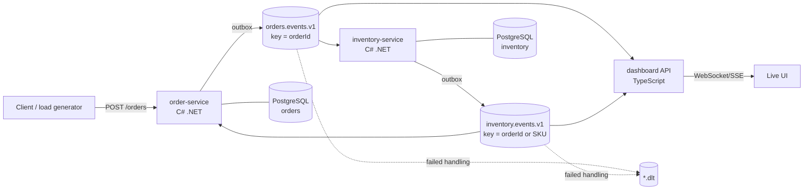

# logos architecture

## System



Contract, payloads and the saga sequence are defined in `services/docs/events.md`; this page doesn't repeat them.

## How each technology earns its place

| Tech | Role | Why it is the right tool here, not just a checkbox |
|---|---|---|
| **C#** | Order and inventory services | Transactional work with EF Core + PostgreSQL; outbox/inbox give exactly-once effects on top of at-least-once delivery |
| **Kafka** | Only channel between services | Durable, replayable, per-order ordering by key; lets the dashboard and add-ons consume without touching the services |
| **TypeScript + Jest** | Dashboard API + UI | Folds `inventory.stock-level-changed` (keep highest `version` per SKU) and order events into live views; Jest covers the projection logic and HTTP/WebSocket layer |
| **Kubernetes** | Runtime | Strimzi runs Kafka declaratively (topics, SCRAM users, ACLs as YAML); services get probes, PDBs, rolling deploys |
| **Jira** | Project management, and optionally data | Backlog lives there (`docs/jira-import.csv`); commits/PRs reference issue keys; the optional add-on turns the board into flow metrics |

## Repo layout (`logos`)

```
logos/
  services/                 C# solution (plan step 2): Contracts, Messaging, Order.Service, Inventory.Service, tests
    docs/events.md          event contract, source of truth
  dashboard/                TypeScript API + UI, Jest (plan step 3)
  deploy/k8s/
    kafka/                  Strimzi cluster, topics, users
    apps/                   order, inventory, dashboard, postgres (plan step 4)
    overlays/{local,cloud}/
  addons/jira-flow/         optional Jira webhook → Kafka → flow metrics
  infra/aks/                AKS cluster (Bicep) for the public demo
  docs/                     architecture, decisions, backlog
  .github/workflows/        CI per component + end-to-end smoke (plan step 4)
```

## Gaps between steps (owned by step 4 unless noted)

- **Kafka auth.** The Strimzi cluster listens on TLS 9093 with SCRAM-SHA-512. The services' `Kafka:SecurityProtocol=SaslSsl`, `SaslUsername`/`SaslPassword` (KafkaUser `order-service` / `inventory-service` and its Secret) and `SslCaLocation` (`logos-kafka-cluster-ca-cert`, key `ca.crt`) connect them; see `services/README.md`.
- **Topic ownership.** Services auto-provision topics at startup, which suits compose. In-cluster, Strimzi `KafkaTopic` CRs own them, so deploy sets `Kafka:ProvisionTopics=false`.
- **"Works in the real world"** needs a public demo: an ingress with TLS, a load generator that places realistic orders, and dashboards showing consumer lag and DLT volume. These are stories in E4 and E5.
